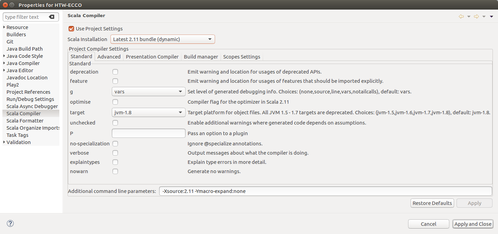

# Daten Management im Rahmen des HTW ECCO Projektstudiums

Scala Spark SciSpark Programm zur Datenbeschaffung und Datenmanagement

## Vorraussetzung
1. Einbinden der externen Library SciSpark
  * [SciSpark](https://drive.google.com/open?id=1Jxyb9vFHc1uyqoPp-nNAJ5nB8XTL7bB9) herunterladen
  * Erstellen eines lib Verzeichnisses root-Verzeichnis dieses Programms
  * Die heruntergeladene SciSpark.jar ins neue lib Verzeichnis bewegen
2. IDE
  * Für Eclipse `sbt eclipse`, Projekt import und die Properties wie im Bild setzen:
  
  * Für IntelliJ import als sbt Projekt

## Testlauf
* Im Terminal: `sbt run`

## Hilfreiche Links
* [Argo DOI](http://www.argodatamgt.org/Access-to-data/Argo-DOI-Digital-Object-Identifier)
* Argo Data FTP: ftp://ftp.ifremer.fr/ifremer/argo
* [SciSpark-API](https://scispark.jpl.nasa.gov/api/)
* [Java-NetCDF-API](https://www.unidata.ucar.edu/software/thredds/v4.3/netcdf-java/v4.3/javadoc/index.html)
* [Apache Zeppelin](https://zeppelin.apache.org/)

## Am Anfang empfohlen
Mittels notebooks von Apache Zeppelin Daten explorieren, weil geringer Konfigurationsaufwand.
Importiere die Notebooks vom Ordner Zeppelin-Notebooks um loszulegen.

## Troubleshooting
* Fragen an [Slack-Gruppe](https://htw-ai-wise-2016.slack.com)
* Bei gelösten Problemen bitte *ReadMe.md* erweitern
